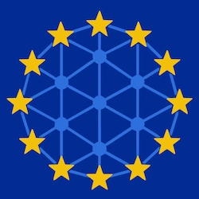

# EuroInference

<p align="center">
  
</p>

<p align="center">
  <strong>Compare open LLM models, prices, context windows, and provider availability across European AI infrastructure.</strong>
</p>

<p align="center">
  <a href="https://euroinference.eu">Live dashboard</a>
  &nbsp; | &nbsp;
  <a href="https://github.com/nichu42/euroinference/issues">Issues</a>
  &nbsp; | &nbsp;
  <a href="LICENSE">AGPL-3.0</a>
</p>

<p align="center">
  <a href="https://github.com/nichu42/euroinference/actions/workflows/update_data.yml"></a>
  <a href="https://github.com/nichu42/euroinference/blob/main/LICENSE"></a>
  <a href="https://nodejs.org/"></a>
</p>

EuroInference is a static, browser-based comparison dashboard for people evaluating model access through European AI providers. It combines provider catalogs, pricing, context limits, capabilities, and availability into one searchable view without sending dashboard input to an application backend.

> [!WARNING]
> **Prices and model information are informational estimates, not quotations.** Data is normalized from public catalogs and converted via periodic ECB rates; displayed IDs/prices/limits may not match the provider's live catalog verbatim — mismatches can occur due to aliasing, differing field definitions, conversion, or timing — and may exclude VAT/surcharges or lag live catalogs. Heuristics (caching, Quality/Value, sovereignty) are estimates, not certifications. Always verify with the provider before deployment. See [Methodology](METHODOLOGY.md) and the footer disclaimer for full details. Not affiliated with any provider.

## Contents

- [Highlights](#highlights)
- [Live dashboard](#live-dashboard)
- [How the comparison works](#how-the-comparison-works)
- [Run locally](#run-locally)
- [Refresh provider data](#refresh-provider-data)
- [Configuration](#configuration)
- [Contributing](#contributing)
- [Privacy and security](#privacy-and-security)
- [Credits and license](#credits-and-license)

## Highlights

- Compare model families across Cortecs, Eden AI, EURouter, GreenPT, Mammouth AI, Mistral AI, Opper AI, and Requesty AI.
- Group provider-specific IDs into normalized model families and creator names.
- Switch between EUR and USD views using the generated Frankfurter/ECB reference rate.
- Sort by **Quality Score** (from [models.deggo.fyi](https://models.deggo.fyi/docs) Quality v4) and **EUR Value Score** (Quality × EU affordability over cheapest EU blended *list price*: `(input + output)/2` from the single cheapest EU offer, same offer — not workload- or cache-adjusted, higher is better; `affordability = 1/(1+log10(1+blended·8)·0.45)`).
- Search and filter by model, creator, provider, minimum context window, release date, deduplication (latest 2 per family), input/output price, and caching-capable providers.
- Estimate the cost of a representative workload with configurable input and output token counts.
- Model prompt-caching economics in the workload estimate with configurable cached-input share and reuse assumptions; filter for caching-capable providers ([methodology](METHODOLOGY.md)).
- Inspect provider offers, context limits, capabilities, modalities, regions, and additional model metadata (weights, release date via models.dev when matched) plus Quality (deggo) and EUR Value (EuroInference heuristic) overview in the detail modal.
- Answer the same data-sovereignty questions on every offer — jurisdiction, retention, training, hosting vs inference, routing — `✓ EU`/`EU (US)`/`EU-Sovereign`/`Global` short badges with `CLOUD Act` nuance, unknown kept visible ([methodology](METHODOLOGY.md)).
- Show one greyed-out non-EU reference offer (OpenRouter) in the detail modal when available, purely for price comparison; it is excluded from all rankings, filters, and estimates.
- Keep the page fast and predictable by shipping a generated `data.js` cache instead of querying provider APIs at page load.
- Show an update warning when a provider refresh failed instead of silently presenting stale records as current.
- Enrich generic model facts (lab, modalities, reasoning, tool call, weights, release date, limits, description) via the [models.dev](https://models.dev) `MIT` catalog when matched.

## Live dashboard

Open the hosted version at **[euroinference.eu](https://euroinference.eu)**.

The dashboard is a static site. Search terms, filters, currency selection, workload assumptions, sorting, and the light/dark theme are handled in your browser. The selected theme is the only preference persisted by the page, under the `euroinference-theme` local storage key.

## How the comparison works

The repository contains two separate parts:

1. `index.html`, `styles.css`, `unify.js` (shared unification engine), `app.js`, and the generated `data.js` render the browser dashboard.
2. `scripts/update_data.js` fetches provider catalogs and pricing, validates response shapes, normalizes model records, and — via the shared `unify.js` engine — groups, prunes and annotates everything into a pre-unified `UNIFIED_MODELS` list, so the browser only filters, converts and renders.

The updater currently collects:

| Source | Purpose |
| --- | --- |
| [models.dev](https://models.dev) | Provider-agnostic model facts (unified name, lab, modalities, reasoning, tool call, weights, description) — `MIT`, baked into `UNIFIED_MODELS[].modelsDev` |
| [models.deggo.fyi](https://models.deggo.fyi/docs) | Readable benchmarks — Quality Score v4 (synthesized) — used with permission, baked into `UNIFIED_MODELS[].deggo` + `DEGGO_META`; **EUR Value** is `Quality × affordabilityEU` over the cheapest EU offer `(in+out)/2` (only synthesized Quality, not raw third-party indexes) |
| Frankfurter | EUR/USD reference exchange rate |
| Mammouth AI | Public model catalog and token pricing |
| Cortecs | OpenAI-compatible model catalog and pricing |
| Eden AI | Model catalog, capabilities, regions, and pricing |
| Opper AI | Model catalog, capabilities, regions, and pricing |
| EURouter | Model catalog, tags, provider offers, and pricing |
| GreenPT | Model catalog and EUR pricing via public `/v1/pricing` |
| Requesty AI | Model catalog, capabilities, retention, and pricing |
| Mistral AI | Authenticated model catalog plus public USD/EUR pricing pages |
| OpenRouter | Non-EU reference offers for the detail modal comparison only (excluded from rankings) |

Provider data is intentionally normalized for comparison. Model names, creator labels, token prices, currencies, context sizes, and capabilities do not necessarily use identical source fields or definitions. Missing or unknown values should be treated as unknown, not as a guarantee that a provider does not support a feature.

## Run locally

Requirements:

- Node.js 18 or newer
- PowerShell on Windows when using `start.ps1`

Start the local server and refresh provider data:

```powershell
.\start.ps1
```

Start with the checked-in cache and skip network updates:

```powershell
.\start.ps1 -SkipUpdate
```

Choose another port:

```powershell
.\start.ps1 -SkipUpdate -Port 9090
```

The default URL is `http://localhost:8080/`. The launcher opens the URL and starts the small Node.js static server in `scripts/serve.js`.

## Refresh provider data

Run the updater directly when changing provider mappings or refreshing the generated cache:

```powershell
node scripts/update_data.js
```

The updater retries temporary failures, validates provider response shapes, records per-source status in `UPDATE_STATUS`, and writes the generated output to `data.js`. Do not edit `data.js` by hand; update the source logic or dictionaries instead.

Mistral's authenticated catalog requires `MISTRAL_API_KEY`. For local work, place it in a gitignored root `.env` file:

```text
MISTRAL_API_KEY=your-key-here
```

The GitHub Actions workflow runs on relevant changes, twice daily, and on manual dispatch. It reads `MISTRAL_API_KEY` from the repository secret and commits generated data changes when the output changes. Never commit `.env`, API keys, or provider credentials.

## Configuration

Contributor-maintained model dictionaries live in [`config/`](config/):

- [`models.json`](config/models.json) is the model registry — `models` with per-model `display_name`/`creator`/`aliases`/`providers` (single format, `-latest` via `models.dev`).
- [`creators.json`](config/creators.json) — creator alias → pretty (`"z.ai": "Zhipu AI"`).
- [`providers.json`](config/providers.json) — provider id → pretty badge (`"mammouth": "Mammouth AI"`).
- [`mistral_pricing.json`](config/mistral_pricing.json) contains only Mistral pricing-page aliases and excluded product categories (OCR/embed/moderation).
- [`benchmark.json`](config/benchmark.json) defines the non-EU reference provider shown in the detail modal (OpenRouter) and its excluded product suffixes (`:free`, `:batch`).
- [`sovereignty.json`](config/sovereignty.json) holds per-provider jurisdiction, retention, training, **hosting vs inference** region, and routing facts (source-linked; omitted = unknown, never fabricated). `hosting` = gateway/control plane, `processing_region` = model inference; `EU-Sovereign` = `jurisdiction EU` + `hosting EU` non-US + `inference EU` non-US + `(European model || open-weights)` on non-US infra.
- [`config/README.md`](config/README.md) documents the schema and contribution conventions.

Prefer a narrow, explicit alias over a broad rule that could merge unrelated model families.

## Validation

Run the existing syntax and JSON/whitespace checks after changes:

```powershell
node --check app.js
node --check unify.js
node --check scripts/update_data.js
node --check scripts/build_credits.js
node --check scripts/build_methodology.js
node --check scripts/build_privacy.js
node --check data.js
git diff --check
# JSON validity (also in pre-commit + CI on every PR)
node -e "JSON.parse(require('fs').readFileSync('config/models.json','utf8'))"
node -e "JSON.parse(require('fs').readFileSync('config/mistral_pricing.json','utf8'))"
```

A `pre-commit` hook runs the same checks (`scripts/hooks/pre-commit` — JS + `config/*.json` + staged `*.json` + `git diff --check`). Enable it once:

```powershell
git config core.hooksPath scripts/hooks
```

If you change provider data or normalization rules, also run `node scripts/update_data.js` with the appropriate local credentials and inspect the generated diff.

If you change pricing or caching logic, regenerate the methodology page and verify the worked examples against the app:

```powershell
node scripts/build_methodology.js
```

If you change credits, regenerate it:

```powershell
node scripts/build_credits.js
```

## Contributing

Bug reports, documentation improvements, configuration fixes, and focused code changes are welcome. Please read [`CONTRIBUTING.md`](CONTRIBUTING.md) and [`CODE_OF_CONDUCT.md`](CODE_OF_CONDUCT.md) first.

- [Report a bug](https://github.com/nichu42/euroinference/issues/new?template=bug_report.md)
- [Request a feature](https://github.com/nichu42/euroinference/issues/new?template=feature_request.md)
- [Open a pull request](https://github.com/nichu42/euroinference/compare)

Please do not use public issues for security vulnerabilities. See [`SECURITY.md`](SECURITY.md).

## Privacy and security

The dashboard has no account system, analytics, advertising, telemetry, or application backend. The page reads the generated cache and keeps comparison inputs in the browser. Loading the hosted site still creates ordinary connection logs at the static host or CDN, and external provider links are governed by their own operators.

- [`PRIVACY.md`](PRIVACY.md) contains the legal notice and privacy policy; the same policy is available in the hosted [`privacy.html`](privacy.html) page.
- [`SECURITY.md`](SECURITY.md) explains coordinated vulnerability reporting.

`privacy.html` is generated from `PRIVACY.md`:

```powershell
node scripts/build_privacy.js
```

The [Cost & Caching Methodology](METHODOLOGY.md) documents every price and cache calculation, the per-provider data mapping, fallback rules for missing cache rates, and the calibration of the default caching assumptions. The hosted page is [`methodology.html`](methodology.html), generated from `METHODOLOGY.md` via `scripts/build_methodology.js`.

## Credits and license

See [`CREDITS.md`](CREDITS.md) for provider, exchange-rate, font, and project-artwork attributions.

EuroInference is free and open-source software licensed under the [GNU Affero General Public License v3.0](LICENSE). Provider names, logos, model names, prices, and other third-party marks remain the property of their respective owners.
